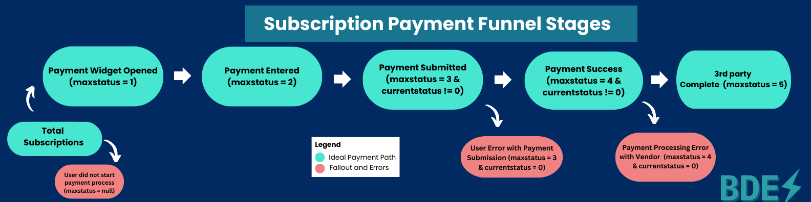
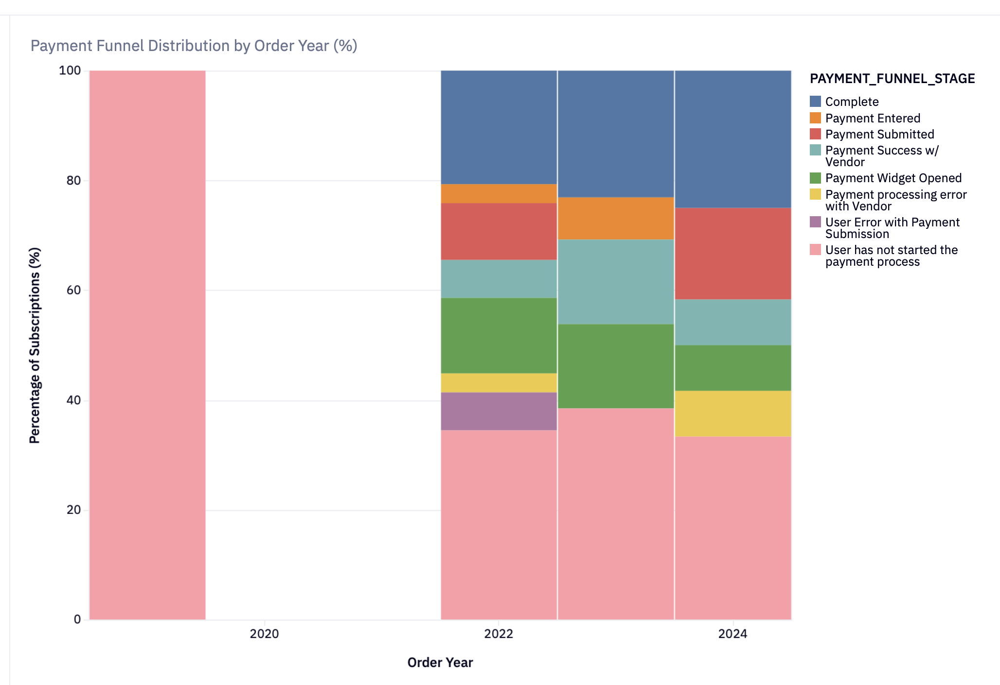
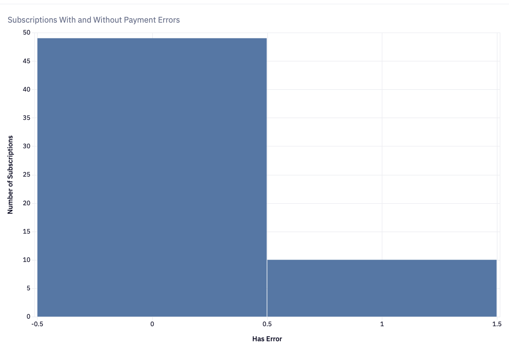
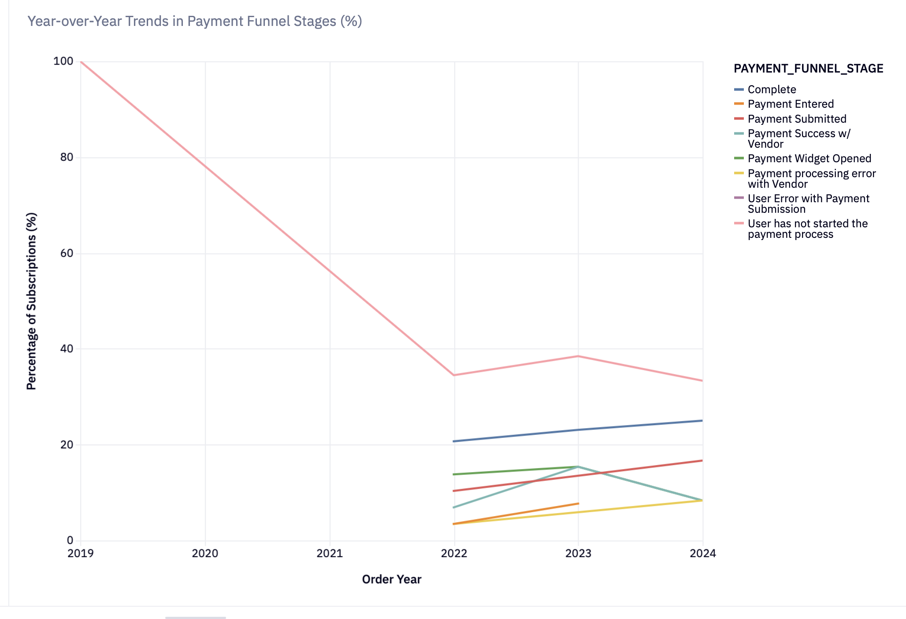

# Payment Funnel Analysis

🔗 **Live Interactive Notebook (Hex):**  
https://github.com/tulsimandira/subscription-payment-funnel-analysis

---

## Executive Summary

A significant share of subscriptions are not converting into paid customers, directly impacting revenue realization. This project reconstructs the end-to-end payment funnel using SQL to identify where and why users drop off in the payment journey and quantify how friction within the payment portal impacts paid conversion.

The analysis shows that approximately one-third of subscriptions fail to initiate the payment process, representing the largest revenue leakage point in the funnel. While completion rates have improved year-over-year, a smaller but persistent portion of users encounter checkout errors.

These findings highlight two high-impact opportunities: improving payment initiation (top-of-funnel activation) and increasing checkout reliability to drive measurable gains in paid conversion.

---

## Business Problem

The finance team observed that a significant number of subscriptions were not converting into paid customers and partnered with the product team to identify where and why users drop off in the payment journey, and whether friction within the online payment portal is negatively impacting conversion rates (the percentage of subscriptions that successfully convert to paid subscriptions).

---

## Methodology

- Exploratory Data Analysis (EDA)  
- Product Funnel Analysis  
- Data Visualization  

---

## Skills

- SQL (CTEs, CASE statements, subqueries, window functions)  
- Data Visualization  
- Data Wrangling  
- Data Cleaning  
- Data Science Notebook  
- Snowflake Data Warehouse  

---

## Results & Business Recommendations

### Results

### Payment Funnel Distribution by Order Year

The year-over-year funnel analysis highlights a persistent top-of-funnel drop-off, with a meaningful share of subscriptions never initiating payment.

- **2022:** 34.48% of subscriptions did not start the payment process, while 20.69% successfully reached the Complete stage.  
- **2023:** Non-starters increased to 38.46%, though completion improved slightly to 23.08%.  
- **2024:** Early-stage drop-off declined to 33.33%, and the completion rate rose further to 25.00%, indicating gradual conversion improvement.  

While completion rates show steady progress, roughly one-third of subscriptions still fail to initiate payment each year, representing the largest leakage point in the funnel.

Additionally, payment reliability remains an opportunity area. Vendor-related outcomes accounted for 6.90% of subscriptions in 2022 and 8.33% vendor processing errors in 2024, suggesting both system-side and user-side friction continue to impact final conversion.

Overall, the data indicates that improving payment initiation and reducing checkout friction would likely yield the highest conversion lift.

---

### Year-over-Year Trends in Payment Funnel Stages

This visualization tracks the percentage distribution of subscriptions across funnel stages by year, enabling normalized comparison independent of total subscription volume.

- In 2019, 100% of subscriptions remained in “User has not started the payment process,” indicating no engagement with the payment portal.  
- By 2022, non-starters declined to 34.48%, with 13.79% opening the payment widget, 3.45% entering payment details, and 20.69% reaching Complete.  
- In 2023, early-stage drop-off increased slightly to 38.46%, while completion improved to 23.08%. Engagement deeper in the funnel also strengthened, with 15.38% opening the widget and 7.69% entering payment details.  
- In 2024, non-starters declined again to 33.33%, and completion reached its highest level at 25.00%, signaling continued conversion improvement. However, vendor-related processing errors remained present (8.33% in 2024), and submission-stage friction persisted.  

Overall, the data shows clear post-2019 adoption of the payment workflow and steady improvements in completion rates. Despite this progress, approximately one-third of subscriptions still fail to initiate payment each year, making top-of-funnel engagement the most significant opportunity for conversion lift.

---

### Subscriptions With and Without Payment Errors

This visualization shows the distribution of subscriptions based on whether they encountered at least one payment error during the checkout process.

Out of all subscriptions, 83.05% did not experience a payment error, while 16.95% encountered at least one error event. Although the majority of users complete checkout without technical issues, nearly 1 in 6 subscriptions experiencing an error represents a meaningful friction point.

Importantly, this segment consists of users who have already demonstrated purchase intent. As a result, improving payment reliability (submission validation and third-party processing stability) represents a high-leverage opportunity to drive incremental conversion gains without requiring structural changes to the broader funnel.

---

## Business Recommendations

- Prioritize alternative payment methods (e.g., Apple Pay, Google Pay) to reduce manual card entry friction and improve first-attempt payment success rates.  
- Establish a structured performance review cadence with the third-party payment processor, supported by error-rate dashboards and SLA tracking to proactively reduce vendor-side failures.  
- Focus on increasing payment initiation by addressing top-of-funnel activation. Given that roughly one-third of subscriptions never start the payment process, targeted reminders, in-product nudges, or proactive outreach could materially improve conversion.  
- Implement ongoing monitoring and alerting for funnel stage drop-offs and payment errors to measure improvement over time and quickly detect regressions following product or vendor changes.  

---

## Next Steps

- Investigate the error breakdown to determine whether user-side or vendor-side failures are the primary drivers of payment errors.  
- Analyze why a significant share of subscriptions never initiate the payment process — assess whether this is due to product friction, unclear user flows, or lack of customer follow-through.
